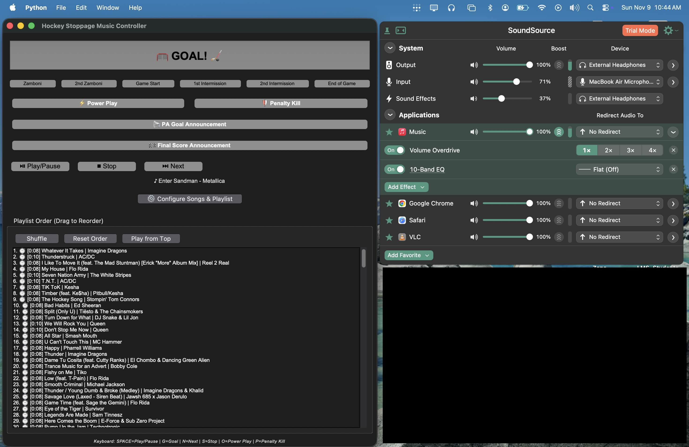

# 🏒 Hockey Music Controller

Game-day music and PA announcements for youth hockey. Drives Apple Music over
AppleScript, announces goals in a custom [Hume AI](https://www.hume.ai) voice,
and gives every kid on the roster their own goal song.




---

> **New to this and not a terminal person?** Read
> [docs/GETTING_STARTED.md](docs/GETTING_STARTED.md): download the ZIP,
> double-click `Start Hockey Music.command`, done.

## ✨ What it does

### Every player gets their moment
- **Personal goal songs** — set a track (and a start time) per jersey number.
  When #88 scores, *his* song plays. No song set? Falls back to the team horn.
- **Names, not numbers** — the announcer says *"Scored by number 7, Alexander
  Mellen! Assisted by number 10, Cale Kulig!"* Assists resolve to names too.
- **PA nicknames** — announce a kid by the name they actually go by.
- **Per-player celebration clips** — a different air horn or "WOO!" per player.
- **Starting lineup** — announce the whole roster before puck drop, one line at
  a time, in your Hume voice.
- **Roster editor** built in — no more hand-editing CSV.

### The announcer works even when the rink wifi doesn't
- **Pre-render before you leave home.** One click renders every goal call and
  the lineup to disk. At the rink they play instantly, offline, and cost nothing.
- **Never freezes.** Rendering and playback run off the UI thread — the old
  build locked up for up to 5 seconds per announcement.
- **Ducks the music** while the PA talks, then brings it back up.
- **Falls back to a macOS voice** if Hume is unreachable, instead of going silent.

### Playlist control built for a live game
- **Multiple pools** — Stoppage, Warmup, Intermission, Power Play — switch in
  one click instead of reloading a playlist between periods.
- **Clip in *and* out points** — grab just the good 20 seconds of a track.
  Right-click → *Set clip points*, or capture the current playback position.
- **Hype points** — `hype_points.py` finds every song's chorus from synced
  lyrics and starts the clip there, so a stoppage opens on the hook, not the intro.
- **One playlist per game** — `game_playlists.py` deals the master playlist into
  disjoint decks for a doubleheader; clip points carry over.
- **Fades instead of hard cuts** on every stop and skip.
- **No-repeat shuffle** — keeps the last dozen tracks out of the front of the deck.
- **Search/filter** the playlist without losing your place.
- **Family-safe mode** — flag a track, and it stays out of rotation.
- **Up-next display** so you always know what the next whistle brings.

---

## 🚀 Quick start

```bash
git clone https://github.com/killercatfish/hockey-music-controller.git
cd hockey-music-controller
bash launch.sh          # or: python3 hockey_music_controller.py
```

### Hume voice setup

Put your key in **`~/.hockey_music/.env`** (preferred — keeps it out of the
repo and out of any `.app` bundle you share):

```
HUME_API_KEY=your_api_key_here
HUME_VOICE_ID=Hockey Goal Announcer
```

A `.env` in the project directory also works. Then:

```bash
pip install hume python-dotenv
```

Without Hume, announcements fall back to a macOS voice.

> ⚠️ **Never commit `.env`.** It is gitignored, but gitignore does not untrack a
> file that is already committed. If a key ever lands in a commit, rotate it —
> scrubbing history is not enough once it has been pushed.

---

## 📖 Game-day flow

**Before you leave home**
1. **👥 Roster** — add players, set each one's goal song and PA nickname.
2. **🎙 Pre-render voice** — render the goal calls and lineup while you have
   good wifi. This is the difference between an instant call and dead air.
3. **⚙️ Settings** — set event songs, fade length, and duck volume.

**Warmups**
- Switch the pool to *Warmup*, hit **🔀 Shuffle**, then **⏏ Play from top**.
- **🎙 Starting Lineup** announces the roster.

**During play**

| Key | Action |
|-----|--------|
| **SPACE** | Play / pause (fades out on pause) |
| **G** | Goal song |
| **N** | Next — fades out and queues the next track |
| **S** | Stop (fade out) |
| **O** | Power play |
| **P** | Penalty kill |
| **A** | Goal announcement dialog |
| **L** | Starting lineup |

Shortcuts are ignored while you are typing in a field.

**When they score**
1. Press **A**.
2. Tap the scorer's number in the quick-pick grid — the field advances to the
   first assist automatically. Tap again for assists.
3. Check the preview. It is the exact text that will be spoken.
4. **🎤 ANNOUNCE GOAL** — plays their goal song, ducks it, announces over the
   top, then fires the celebration clip.

**End of game**
- **🏁 Final Score**.

---

## 🎛️ Clip points

Right-click any track → **Set clip points**. Set a start, an end, or both;
*Use current position* captures wherever playback is right now. Tracks with
clips show `⏱0:15–1:20` in the list, and the out point fades rather than cutting.

Leave the end blank to play to the end of the track.

---

## 📁 Layout

```
hockey-music-controller/
├── hockey_music_controller.py   # entry point (thin shim)
├── hockeymusic/
│   ├── announcements.py         # all announcement copy, one source of truth
│   ├── announcer.py             # Hume TTS, disk cache, ducking, async playback
│   ├── config.py                # settings + migration from v1/v2
│   ├── music.py                 # AppleScript, fades, volume
│   ├── paths.py                 # filesystem locations
│   ├── playlists.py             # pools, clips, shuffle, family-safe
│   ├── roster.py                # players and their goal songs
│   └── ui/                      # tkinter windows
├── tests/                       # 37 tests, no Apple Music required
├── rosters/                     # your roster CSVs (gitignored)
└── sound_clips/                 # celebration clips (gitignored)
```

**Where your data lives**
- `~/hockey_music_config.json` — settings, pools, clip points
- `~/.hockey_music/tts_cache/` — pre-rendered announcement audio
- `~/.hockey_music/.env` — your Hume key

Upgrading from v2 migrates your old config automatically and writes a
`hockey_music_config.json.v2bak` backup first. Old two-column roster CSVs
still load; saving from the roster editor upgrades them in place.

---

## 🧪 Tests

```bash
python3 tests/test_core.py       # announcements, roster, playlists, migration
python3 tests/test_ui_smoke.py   # builds every window against a fake Music app
```

Neither needs Apple Music running or a network connection.

---

## 🐛 Troubleshooting

**"Could not read playlists. Is Music running?"** — open Music and authorize
automation when macOS prompts. Only user-created playlists are listed.

**A song won't play** — the title must match Apple Music exactly, including
punctuation. Use **▶ Test** next to each event song in Settings.

**Announcements are slow** — they are rendering live. Run **🎙 Pre-render voice**
on good wifi; cached lines play instantly.

**"Voice not found"** — `HUME_VOICE_ID` must match the voice name in your Hume
dashboard exactly.

**`No module named '_tkinter'`** — install Python from
[python.org](https://www.python.org/downloads/) rather than Homebrew.

---

## 📚 More docs

- [docs/HUME_VOICE_SETUP.md](docs/HUME_VOICE_SETUP.md) — custom voice, API key, pre-rendering
- [docs/CLIP_POINTS.md](docs/CLIP_POINTS.md) — start and end points
- [docs/SPOTIFY_TO_APPLE_MUSIC.md](docs/SPOTIFY_TO_APPLE_MUSIC.md) — playlist migration
- [rosters/README.md](rosters/README.md) — roster CSV format
- [CLAUDE.md](CLAUDE.md) — architecture and invariants, for anyone changing the code

---

## 📝 License

MIT — see [LICENSE](LICENSE).

**Made with ❤️ for hockey game operations**
